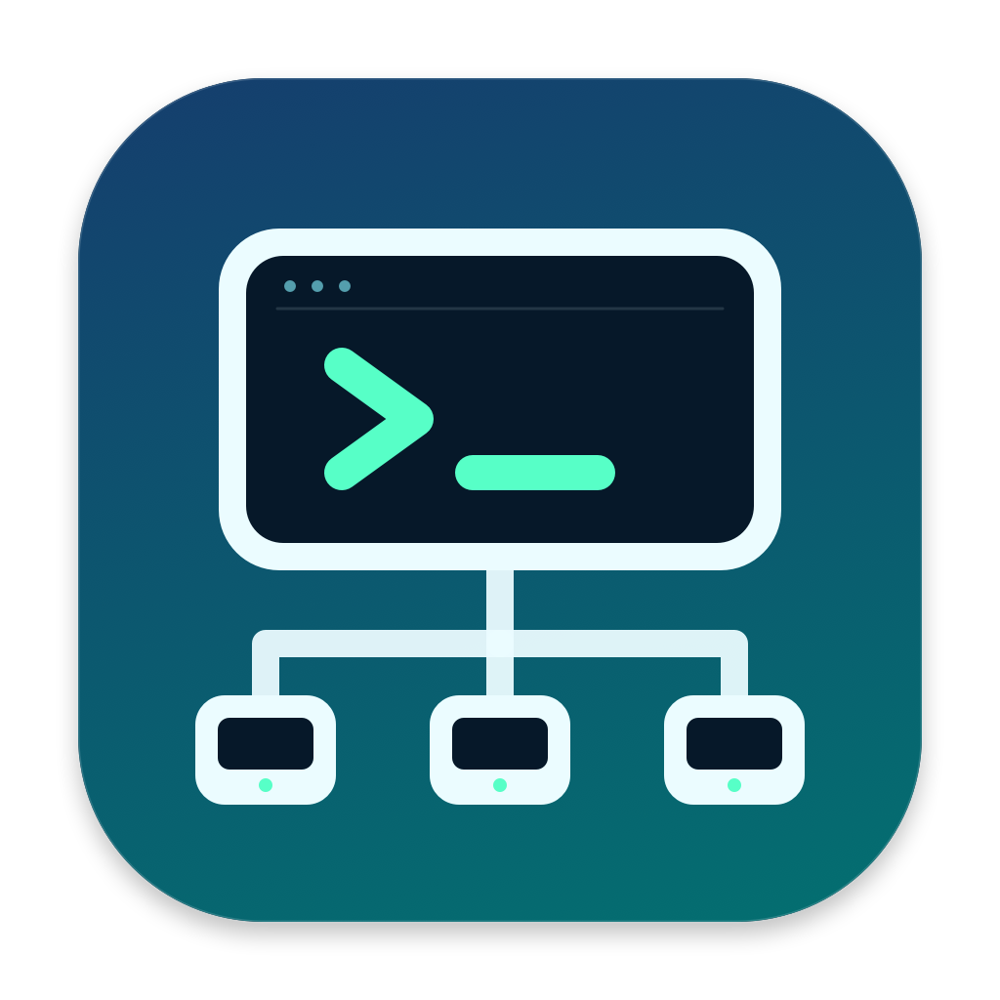

# LanDeviceConnect

LanDeviceConnect is a SwiftUI macOS app for managing SSH-accessible devices on a local network.

## Features

- Save devices with a hostname or IP address, SSH port, username, and authentication settings.
- Discover SSH hosts through Bonjour (`_ssh._tcp.`) and TCP port 22 scans of the local IPv4 `/24` range. Resolve subnet hostnames in the background and enrich matching hosts with advertised manufacturer/model details.
- Check each saved device's configured SSH port every 15 seconds, or refresh manually.
- Open an SSH session in Terminal and send shutdown or restart commands from the app.
- Use SSH keys or password authentication, review scanned host-key fingerprints when adding a device, and respond to sudo password prompts.
- Keep the device list and status in a local SQLite database.

## Requirements

- macOS 13 or later, matching the current deployment target.
- Xcode with the macOS SDK and command-line tools selected for `xcodebuild`.
- SSH enabled on the remote devices and credentials accepted by those devices.
- Permission to control Terminal when macOS requests it for the Open in Terminal action.
- `fswatch` for automatic rebuilds; `xcpretty` is optional for formatted build output.

SwiftUI, AppKit, Foundation, Combine, Network, and SQLite3 are provided by the macOS SDK. The default build requires no third-party SSH library.

## Build and run

From the `LanDeviceConnect/` directory:

```sh
make build
make run
make clean
```

`make build` invokes `xcodebuild` and writes build output to `.derived/` in the current directory. `make run` builds and opens `LanDeviceConnect.app`; `make clean` removes that directory's build output.

To use Xcode, open [`LanDeviceConnect.xcodeproj`](LanDeviceConnect.xcodeproj), select the **LanDeviceConnect** scheme and **My Mac** destination, choose a signing team if required, then build and run.

For a build without code signing:

```sh
xcodebuild -project LanDeviceConnect.xcodeproj \
  -scheme LanDeviceConnect \
  -configuration Debug \
  -destination "platform=macOS,arch=$(uname -m)" \
  -derivedDataPath .derived \
  build CODE_SIGNING_ALLOWED=NO
```

To rebuild automatically when source files change, run the watcher from the application directory:

```sh
bash scripts/watch.sh
```

## Verification

Run the regression checks from this directory:

```sh
make test
```

Tests compile with warnings treated as errors and check reachable/refused local TCP connections, 200 simultaneous connection/timeout races, invalid ports, and device additions/removals during a status refresh. Repository tests use an in-memory database fixture and do not access saved devices or credentials.

To check for data races with Thread Sanitizer:

```sh
bash scripts/test.sh --sanitize-thread
```

Discovery tests also cover duplicate merging, metadata ordering, malformed records, and a locally published reverse-DNS record with timeout/cancellation checks.

Status-check completion is serialized by an actor; discovery result updates and repository refresh state stay on the main actor. The build selects the current Mac's architecture explicitly to avoid ambiguous destinations. App Intents metadata extraction is skipped because this app defines no App Intents.

## Using the app

1. Choose **Add Device** or press **Command-N** to open the Add Device page inside the current window.
2. Select a discovered host to fill in its name, host, and port, or enter those details manually. The sidebar shows the resolved name, address, and advertised manufacturer/model when available; IP and Bonjour results for the same SSH endpoint share a row.
3. Enter the SSH username and choose key-based or password authentication. Supply a key path or password as needed.
4. If **Trust host key on first connect** is enabled, review the scanned fingerprints before saving.
5. Saving a device returns to the device list in the same window. To leave without saving, use the top-left **Back to Devices** (‹) button, **Cancel**, or **Escape**.
6. Use the device list to open Terminal, refresh status, or send shutdown and restart commands. Remote shutdown and restart require suitable sudo permissions.

Device identification uses DNS/mDNS reverse lookups and Bonjour SSH, workstation, SMB, and device-info advertisements. Workstation, SMB, and device-info services supply metadata only; they are not added as SSH hosts. Hostname lookups have a two-second timeout and do not block the device list. Manufacturer/model values come from advertised TXT records; no vendor is guessed from an IP address, SSH software, or device name. Devices with no available name remain identified by IP. Selecting a subnet result keeps its scanned IP as the connection target, even when a reverse-DNS display name is available.

Online status means a TCP connection to the configured SSH port succeeded; it does not confirm authentication or command permissions. Subnet discovery assumes a `/24` IPv4 range and scans port 22, so add devices manually when they use other ports or networks.

## SSH implementations

All custom Swift types use the `LDC` prefix, including classes, structs, enums, protocols, and views.

- `LDCSSHClient` defines the command execution interface.
- `LDCProcessSSHClient` runs `/usr/bin/ssh` with `BatchMode=yes` for key or SSH-agent authentication.
- `LDCExpectSSHClient` runs `/usr/bin/expect` for password authentication when NMSSH is unavailable. This requires that executable to be present.
- `LDCNMSSHClient` is an optional implementation compiled under `#if canImport(NMSSH)`. The repository selects it when NMSSH is available; otherwise, it uses the system SSH and Expect clients.
- `LDCTerminalLauncher` opens interactive SSH sessions in Terminal through AppleScript.

## Persistence and credentials

`LDCDeviceStore` uses the system SQLite3 library. To preserve devices saved before the rename, the database remains at:

```text
~/Library/Application Support/SSHMacApp/devices.sqlite3
```

The `SSHMacApp` directory is retained for compatibility. The current project, target, scheme, and app product are named `LanDeviceConnect`; the bundle identifier is `com.example.LanDeviceConnect`.

Device passwords, including remembered sudo passwords, are stored in SQLite without encryption. For production use, move secrets to Keychain and keep only references in the database.

## App icon

The icon shows an SSH terminal connected to three LAN devices, reflecting the app's device management and remote command features. It is packaged in `App/Assets.xcassets/AppIcon.appiconset` so Finder and the Dock use the same artwork.



The asset catalog includes all ten macOS icon slots, following [Apple's app icon asset format](https://developer.apple.com/library/archive/documentation/Xcode/Reference/xcode_ref-Asset_Catalog_Format/AppIconType.html):

| Size in points | 1× pixels | 2× pixels |
| --- | --- | --- |
| 16 × 16 | 16 × 16 | 32 × 32 |
| 32 × 32 | 32 × 32 | 64 × 64 |
| 128 × 128 | 128 × 128 | 256 × 256 |
| 256 × 256 | 256 × 256 | 512 × 512 |
| 512 × 512 | 512 × 512 | 1024 × 1024 |

`LDCIconGenerator.swift` is the vector artwork source. Small variants omit fine details for readability. To regenerate every PNG and the asset manifest from this directory:

```sh
make icons
```

The exporter in `scripts/generate-icons.swift` renders exact pixel dimensions through AppKit. Xcode compiles the assets into `AppIcon.icns` and includes the icon metadata in the app bundle; the app does not override its icon at runtime.

## Project structure

```text
LanDeviceConnect/
├── LanDeviceConnect.xcodeproj/
│   └── xcshareddata/xcschemes/LanDeviceConnect.xcscheme
├── App/
│   ├── Assets.xcassets/
│   │   └── AppIcon.appiconset/
│   ├── Info.plist
│   └── LDCLanDeviceConnectApp.swift
├── Models/
│   ├── LDCDevice.swift
│   └── LDCDeviceStatus.swift
├── Services/
│   ├── LDCDeviceStore.swift
│   ├── LDCDiscoveryService.swift
│   ├── LDCExpectSSHClient.swift
│   ├── LDCHostKeyService.swift
│   ├── LDCSSHClient.swift
│   ├── LDCStatusChecker.swift
│   ├── LDCSubnetScanner.swift
│   └── LDCTerminalLauncher.swift
├── ViewModels/
│   └── LDCDeviceRepository.swift
├── Views/
│   ├── LDCAddDeviceFlowView.swift
│   ├── LDCAddDeviceFormView.swift
│   ├── LDCAddDeviceView.swift
│   ├── LDCDeviceListView.swift
│   └── Components/
│       ├── LDCDeviceRowView.swift
│       ├── LDCHostKeyConfirmView.swift
│       ├── LDCStatusDot.swift
│       └── LDCSudoPasswordPromptView.swift
├── Tests/
│   ├── LDCStatusCheckerTests.swift
│   └── Fixtures/
│       └── LDCInMemoryDeviceStore.swift
├── LDCIconGenerator.swift
├── Makefile
├── README.md
└── scripts/
    ├── generate-icons.sh
    ├── generate-icons.swift
    ├── test.sh
    └── watch.sh
```

The tree is shown relative to the repository root. See the [repository README](../README.md) for screenshots and the previous release.

## License

See [LICENSE](../LICENSE) for the GNU General Public License, version 3.
