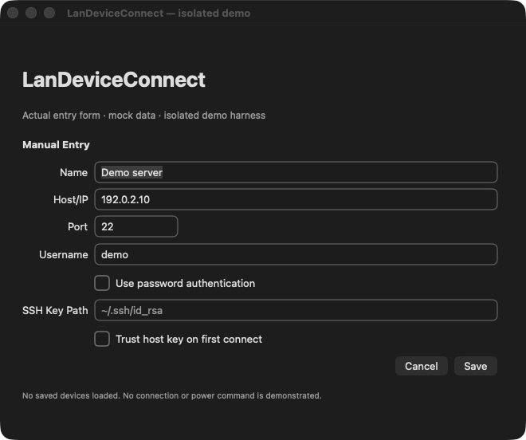

# LanDeviceConnect

Manage SSH devices on your local network from one macOS app. For home-lab users who want a saved device list, reachability checks, and quick Terminal access.

[Build and run](#get-started) · [User guide](docs/user-guide.md) · [Questions and feedback](https://github.com/chandanankush/lan-devices/discussions)

- Discover devices and see available hostnames and device details.
- Save connection settings and check whether devices are online.
- Open an SSH session in Terminal.
- Shut down or restart a device after confirming the action.

## Get started

You need macOS 13 or later, Xcode to build the app, and a remote device with SSH enabled. No packaged GitHub release is currently published; build from source. See [command-line builds](docs/development.md#build-and-run) for an unsigned local build. A local build is not a notarized distribution.

1. Open [LanDeviceConnect.xcodeproj](LanDeviceConnect/LanDeviceConnect.xcodeproj) in Xcode.
2. Select the **LanDeviceConnect** scheme and **My Mac**, then run the app. Choose a signing team if Xcode requests one.
3. Click **+** or press **Command-N** to add a device.
4. Select a discovered device or enter its address, then supply your SSH username and authentication settings.
5. Click **Save** to return to your device list.

Use the Terminal icon to connect. The power icon offers **Shut Down…** and **Restart…**; both require confirmation. Use **Back**, **Cancel**, or **Escape** to leave Add Device without saving.

Discovery cannot identify every device. You can always add a host manually, including one that uses a different SSH port. “Online” means its SSH port responds; it does not verify your login.

## Passwords and privacy

Prefer SSH keys. Saved passwords, including remembered sudo passwords, are currently stored **without encryption** on your Mac. Read the [security notes](SECURITY.md) before using password authentication.

## Preview

*Actual entry-form view compiled unchanged in a local demo harness. Host, username, and key path are invented examples. The harness does not load saved devices or demonstrate discovery, login, saving, or power actions.* [Short form walkthrough](docs/assets/add-device-demo.gif) (two captured states; condensed timing).

## Support and contribution

Ask setup questions in [Discussions](https://github.com/chandanankush/lan-devices/discussions), starting with the [welcome thread](https://github.com/chandanankush/lan-devices/discussions/3). For reproducible problems, [open an issue](https://github.com/chandanankush/lan-devices/issues/new/choose) with the commit, macOS version, and sanitized steps.

Read [CONTRIBUTING.md](CONTRIBUTING.md), then browse [good first issues](https://github.com/chandanankush/lan-devices/labels/good%20first%20issue) or [manual-testing requests](https://github.com/chandanankush/lan-devices/labels/help%20wanted).

## More information

- [User guide](docs/user-guide.md): connections, discovery, and troubleshooting.
- [Development](docs/development.md): command-line builds, tests, and app icons.
- [Architecture](docs/architecture.md): how the app is organized.
- [Security](SECURITY.md): data handling, current limitations, and reporting concerns.

## License

[GNU General Public License, version 3](LICENSE).
